<h1 align="center">Watchlistr</h1>

  
App Gallery

  

    <table>
      <tr>
        <td align="center">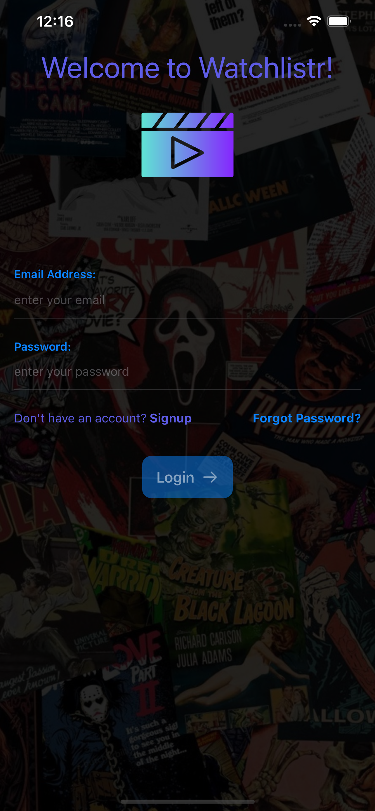</td>
        <td align="center">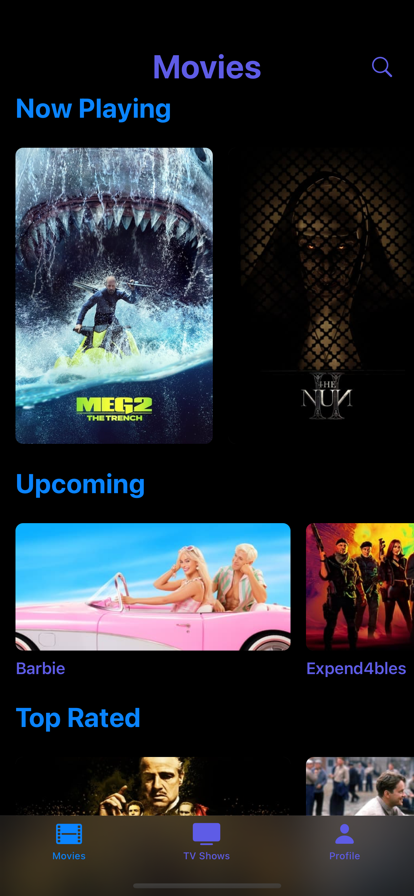</td>
        <td align="center">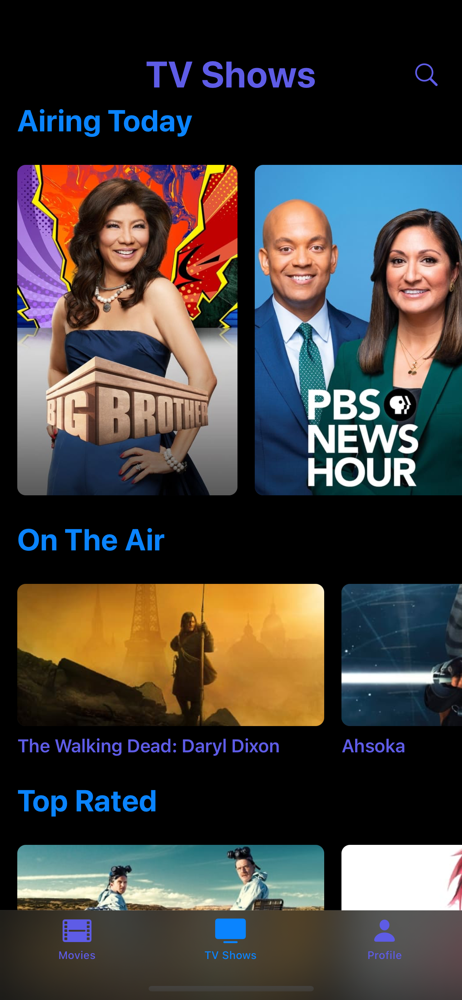</td>
        <td align="center">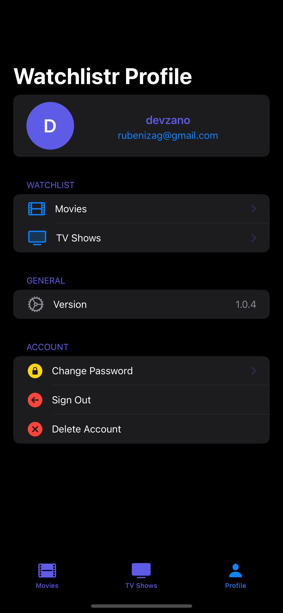</td>
      </tr>
      <tr>
        <td align="center">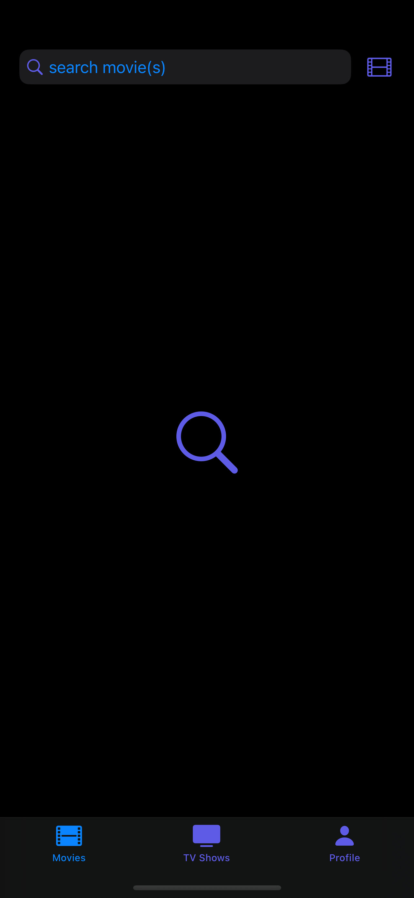</td>
        <td align="center">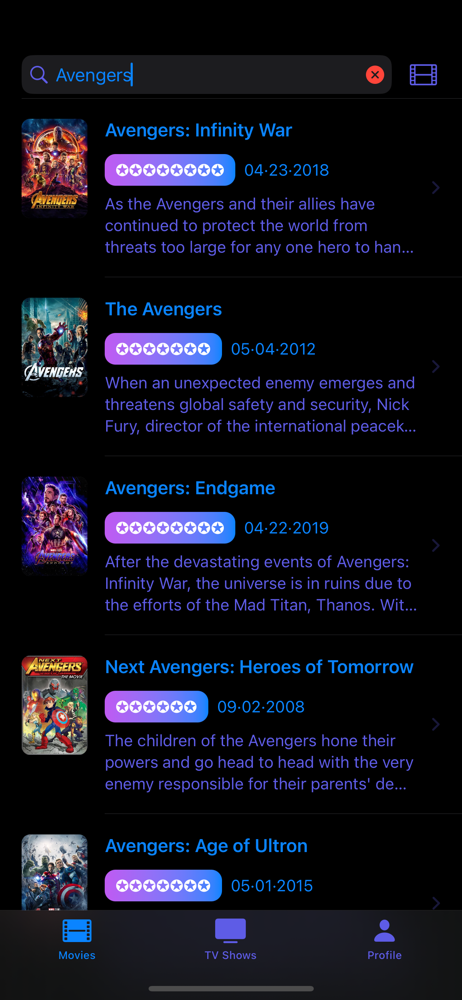</td>
        <td align="center">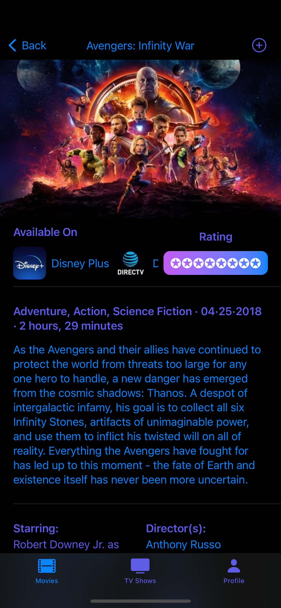</td>
       <td align="center">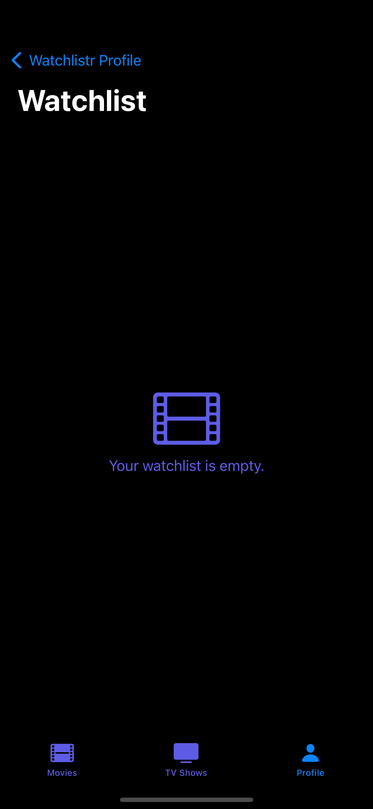</td>
      </tr>
      <tr>
        <td align="center">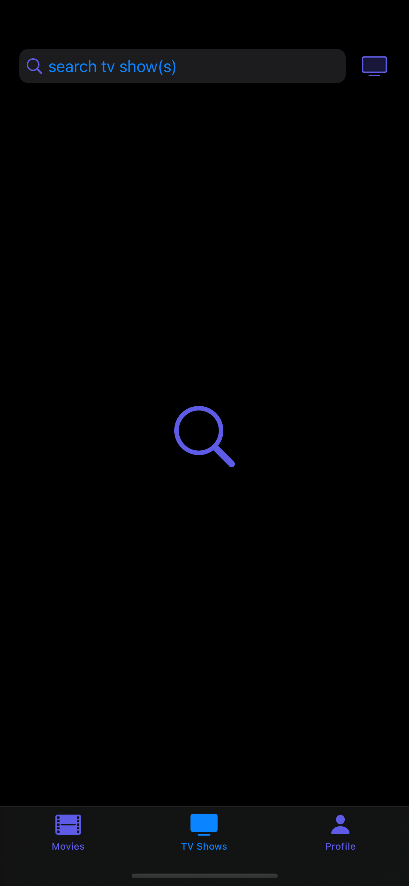</td>
        <td align="center">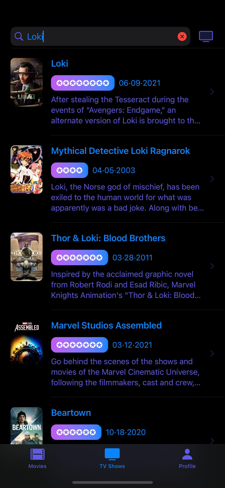</td>
        <td align="center">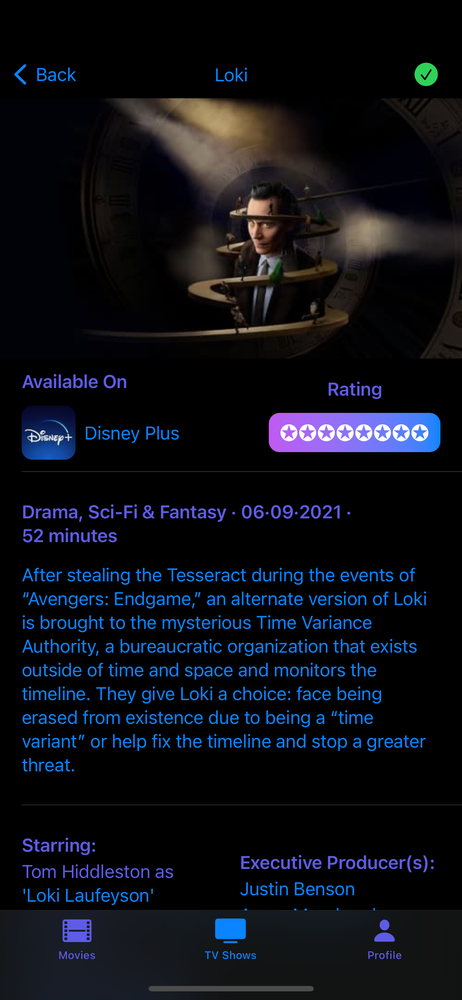</td>
        <td align="center">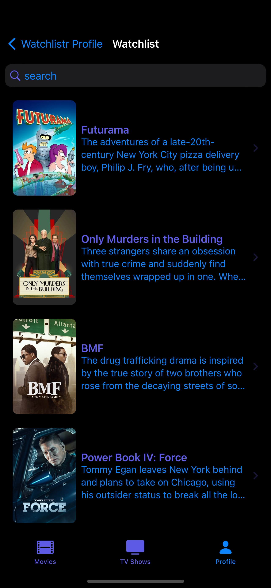</td>
      </tr>
    </table>
  

Watchlistr is designed to help users keep track of movies and TV shows they'd like to watch. With an intuitive UI and easy-to-navigate tabs, users can effortlessly browse through movies, TV shows, and even see where they can watch them based on available providers.

### Built With
* Xcode
* SwiftUI
* Firebase Authentication
* Firebase Database

### Features
* __Authentication__ powered by Google Firebase to ensure user data protection.
* __Movies & TV Shows Tabs__ showcasing the latest & top-rated selections. Plus, with a tailored search to find that specific gem you're after.
* __Profiles__ have a dedicated section for your watchlists breakdown & also a space for users to refine account details.
* __Watchlists__ for each users to house all their favorited movies & TV shows.
* __Watch Providers__ laying out all the available watching platforms for each media.

### Contributions
Contributions to Watchlistr are welcome! If you have any feature suggestions, bug reports, or other improvements.

#### License
Copyright © 2023 devzano. All rights reserved.

##### Credits
<small><a href="https://firebase.google.com/">Firebase</a>></small>
 
<small><a href="https://developer.themoviedb.org/docs">TMDB</a></small>
 
<small><a href="https://www.justwatch.com/">JustWatch</a></small>